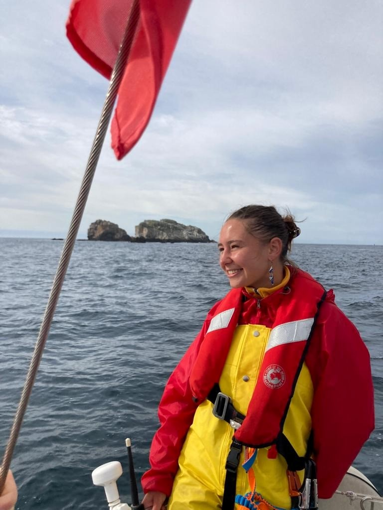

  

<h1 align="center">Eline Brunet</h1>

<strong>Doctorante</strong> – Laboratoire des Sciences du Climat et de l’Environnement (LSCE)

---

## Recherche
- Biogéochimie marine
- Polluants et métaux traces
- Modélisation océanique

---

## Publication
Barkhordarian, A., Brunet, E., & Baehr, J. (2025)  
*Compound coastal marine–terrestrial heatwaves associated with humid-heat stress in Europe*  
[Scientific Reports, 15, 43810](https://www.nature.com/articles/s41598-025-32049-z)

---

## Contact
📧 eline.brunet@lsce.ipsl.fr
